# Raft算法
- Raft本意是木筏，几根原木捆扎在一起便是木筏，寓意着集群管理的简单和便捷  

## 概述

Raft 在实际工程上是使用较为广泛的算法。但在学术理论上，最出名的是 Paxos。但 Paxos 算法很复杂也很难理理解，Raft 算法的作者也花了很长的时间去理解 Paxos ，且 Paxos 算法很难构建一个工程系统，于是他们就决定研究一种易于理解的一致性算法 ---- Raft 算法。

Raft 是一个一致性算法，所谓一致性，就是即使是在部分节点故障、网络延时、网络分割的情况下，多个节点也能对某个事情达成一致。Raft 设计得非常容易理解，在容错性和性能上于 Paxos 相当。  

Raft 作者为了达到易于理解的目标，主要做了两件事情：
1. **算法分解**：主要被分成了领导人选举，日志复制和安全三个模块。   
2. **减少状态机的状态**：减少了非确定性和服务器互相处于非一致性的方式。

### 应用场景

Raft 算法常应用于分布式系统。比如分布式存储中的复制集，加密货币（比特币、区块链）等。

## 原理

Raft 通过选举一个领导人，然后给予他全部的管理复制日志的责任来实现一致性。领导人从客户端接收日志条目（log entries），把日志条目复制到其他服务器上，并告诉其他的服务器什么时候可以安全地将日志条目应用到他们的状态机中。

通过领导人的方式，Raft 将一致性问题分解成了三个相对独立的子问题：
1. **领导选举**：当现存的领导人发生故障的时候, 一个新的领导人需要被选举出来
2. **日志复制**：领导人必须从客户端接收日志条目（log entries）然后复制到集群中的其他节点，并强制要求其他节点的日志和自己保持一致。
3. **安全性**：主要是状态机安全，如果有任何的服务器节点已经应用了一个确定的日志条目到它的状态机中，那么其他服务器节点不能在同一个日志索引位置应用一个不同的指令。

节点的**状态**：
1. 领导人（Leader）：接受客户端请求，并向Follower同步请求日志，当日志同步到大多数节点上后告诉Follower提交日志。
2. 跟随者（Follower）：接受并持久化Leader同步的日志，在Leader告之日志可以提交之后，提交日志。
3. 候选人（Candidate）：Leader选举过程中的临时角色。

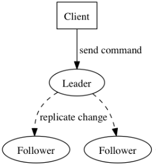

**状态转换**：

Follower只响应其他服务器的请求。如果Follower超时没有收到Leader的消息，它会成为一个Candidate并且开始一次Leader选举。收到大多数服务器投票的Candidate会成为新的Leader。Leader在宕机之前会一直保持Leader的状态。

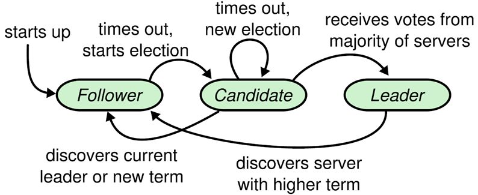

**任期**：Raft 把时间分割成任意长度的任期，一个任期内只允许有一个leader，正常工作期间只有Leader和Followers。每一个term的开始都是Leader选举。在成功选举Leader之后，Leader会在整个term内管理整个集群。如果Leader选举失败，该term就会因为没有Leader而结束。

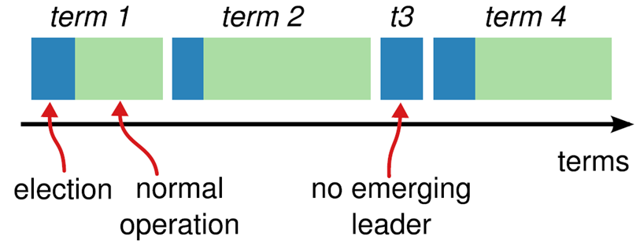

## Leader选举
Raft 使用心跳（heartbeat）触发Leader选举。当服务器启动时，初始化为Follower。Leader向所有Followers周期性发送heartbeat。如果Follower在选举超时时间内没有收到Leader的heartbeat，就会等待一段随机的时间后发起一次Leader选举。

Follower将其当前term加一然后转换为Candidate。它首先给自己投票并且给集群中的其他服务器发送 RequestVote RPC。结果有以下三种情况：
1. 赢得了多数的选票，成功选举为Leader；
2. 收到了Leader的消息，表示有其它服务器已经抢先当选了Leader；
3. 没有服务器赢得多数的选票，Leader选举失败，等待选举时间超时后发起下一次选举。

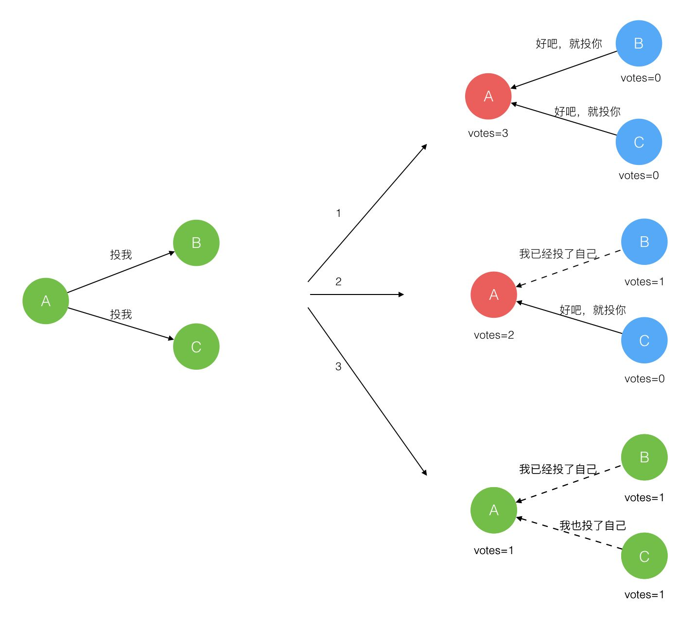

选举出Leader后，Leader通过定期向所有Followers发送心跳信息维持其统治。若Follower一段时间未收到Leader的心跳则认为Leader可能已经挂了，再次发起Leader选举过程。

Raft保证选举出的Leader上一定具有最新的已提交的日志。

## 日志同步
Leader选出后，就开始接收客户端的请求。Leader把请求作为日志条目（Log entries）加入到它的日志中，然后并行的向其他服务器发起 AppendEntries RPC 复制日志条目。当这条日志被复制到大多数服务器上，Leader将这条日志应用到它的状态机并向客户端返回执行结果。

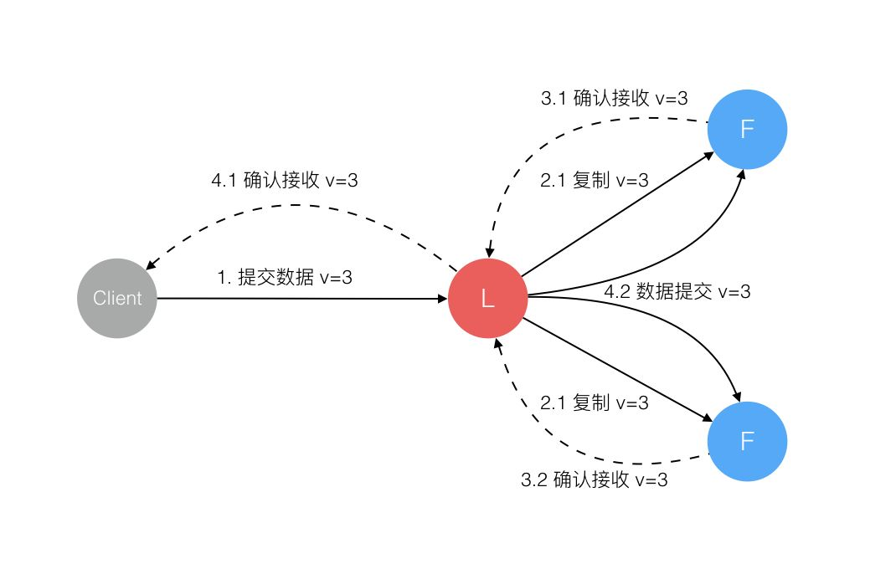

某些Followers可能没有成功的复制日志，Leader会无限的重试 AppendEntries RPC直到所有的Followers最终存储了所有的日志条目。

**日志**由有序编号（log index）的日志条目组成。每个日志条目包含它被创建时的任期号（term），和用于状态机执行的命令。如果一个日志条目被复制到大多数服务器上，就被认为可以提交（commit）了。

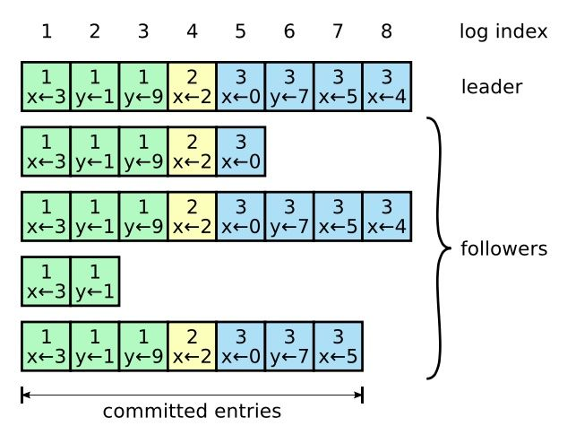

Raft日志同步保证如下两点：
1. 如果不同日志中的两个条目有着相同的索引和任期号，则它们所存储的命令是相同的。
2. 如果不同日志中的两个条目有着相同的索引和任期号，则它们之前的所有条目都是完全一样的。

第一条特性源于Leader在一个term内在给定的一个log index最多创建一条日志条目，同时该条目在日志中的位置也从来不会改变。

第二条特性源于 AppendEntries 的一个简单的一致性检查。当发送一个 AppendEntries RPC 时，Leader会把新日志条目紧接着之前的条目的log index和term都包含在里面。如果Follower没有在它的日志中找到log index和term都相同的日志，它就会拒绝新的日志条目。

一般情况下，Leader和Followers的日志保持一致，因此 AppendEntries 一致性检查通常不会失败。然而，Leader崩溃可能会导致日志不一致：旧的Leader可能没有完全复制完日志中的所有条目。

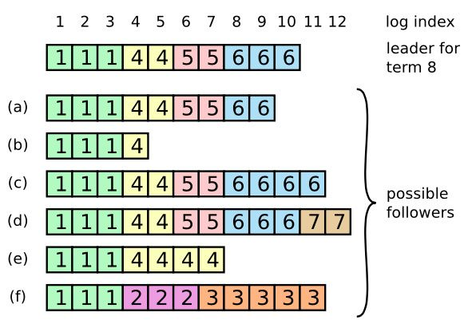

上图是一些Followers可能和新的Leader日志不同的情况。一个Follower可能会丢失掉Leader上的一些条目，也有可能包含一些Leader没有的条目，也有可能两者都会发生。丢失的或者多出来的条目可能会持续多个任期。

Leader通过强制Followers复制它的日志来处理日志的不一致，Followers上的不一致的日志会被Leader的日志覆盖。

Leader为了使Followers的日志同自己的一致，Leader需要找到Followers同它的日志一致的地方，然后覆盖Followers在该位置之后的条目。  
Leader会从后往前试，每次AppendEntries失败后尝试前一个日志条目，直到成功找到每个Follower的日志一致位点，然后向后逐条覆盖Followers在该位置之后的条目。

## 安全性
Raft增加了如下两条限制以保证安全性：
1. 拥有最新的已提交的log entry的Follower才有资格成为Leader。
- 这个保证是在RequestVote RPC中做的，Candidate在发送RequestVote RPC时，要带上自己的最后一条日志的term和log index，其他节点收到消息时，如果发现自己的日志比请求中携带的更新，则拒绝投票。日志比较的原则是，如果本地的最后一条log entry的term更大，则term大的更新，如果term一样大，则log index更大的更新。
2. Leader只能推进commit index来提交当前term的已经复制到大多数服务器上的日志，旧term日志的提交要等到提交当前term的日志来间接提交（log index 小于 commit index的日志被间接提交）。  

之所以要这样，是因为可能会出现已提交的日志又被覆盖的情况：

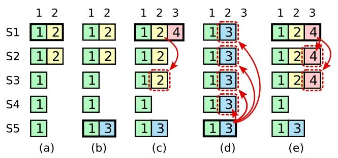

在阶段a，term为2，S1是Leader，且S1写入日志（term, index）为(2, 2)，并且日志被同步写入了S2；

在阶段b，S1离线，触发一次新的选主，此时S5被选为新的Leader，此时系统term为3，且写入了日志（term, index）为（3， 2）;

S5尚未将日志推送到Followers就离线了，进而触发了一次新的选主，而之前离线的S1经过重新上线后被选中变成Leader，此时系统term为4，此时S1会将自己的日志同步到Followers，按照上图就是将日志（2， 2）同步到了S3，而此时由于该日志已经被同步到了多数节点（S1, S2, S3），因此，此时日志（2，2）可以被提交了。；

在阶段d，S1又下线了，触发一次选主，而S5有可能被选为新的Leader（这是因为S5可以满足作为主的一切条件：1. term = 5 > 4，2. 最新的日志为（3，2），比大多数节点（如S2/S3/S4的日志都新），然后S5会将自己的日志更新到Followers，于是S2、S3中已经被提交的日志（2，2）被截断了。

增加上述限制后，即使日志（2，2）已经被大多数节点（S1、S2、S3）确认了，但是它不能被提交，因为它是来自之前term（2）的日志，直到S1在当前term（4）产生的日志（4， 4）被大多数Followers确认，S1方可提交日志（4，4）这条日志，当然，根据Raft定义，（4，4）之前的所有日志也会被提交。此时即使S1再下线，重新选主时S5不可能成为Leader，因为它没有包含大多数节点已经拥有的日志（4，4）。

## 日志压缩
在实际的系统中，不能让日志无限增长，否则系统重启时需要花很长的时间进行回放，从而影响可用性。Raft采用对整个系统进行snapshot来解决，snapshot之前的日志都可以丢弃。

每个副本独立的对自己的系统状态进行snapshot，并且只能对已经提交的日志记录进行snapshot。

Snapshot中包含以下内容：
1. 日志元数据。最后一条已提交的 log entry的 log index和term。这两个值在snapshot之后的第一条log entry的AppendEntries RPC的完整性检查的时候会被用上。
2. 系统当前状态。

当Leader要发给某个日志落后太多的Follower的log entry被丢弃，Leader会将snapshot发给Follower。或者当新加进一台机器时，也会发送snapshot给它。发送snapshot使用InstalledSnapshot RPC（RPC细节参见八、Raft算法总结）。

做snapshot既不要做的太频繁，否则消耗磁盘带宽， 也不要做的太不频繁，否则一旦节点重启需要回放大量日志，影响可用性。推荐当日志达到某个固定的大小做一次snapshot。

做一次snapshot可能耗时过长，会影响正常日志同步。可以通过使用copy-on-write技术避免snapshot过程影响正常日志同步。

## 成员变更
成员变更是在集群运行过程中副本发生变化，如增加/减少副本数、节点替换等。

成员变更也是一个分布式一致性问题，既所有服务器对新成员达成一致。但是成员变更又有其特殊性，因为在成员变更的一致性达成的过程中，参与投票的进程会发生变化。

如果将成员变更当成一般的一致性问题，直接向Leader发送成员变更请求，Leader复制成员变更日志，达成多数派之后提交，各服务器提交成员变更日志后从旧成员配置（Cold）切换到新成员配置（Cnew）。

因为各个服务器提交成员变更日志的时刻可能不同，造成各个服务器从旧成员配置（Cold）切换到新成员配置（Cnew）的时刻不同。

成员变更不能影响服务的可用性，但是成员变更过程的某一时刻，可能出现在Cold和Cnew中同时存在两个不相交的多数派，进而可能选出两个Leader，形成不同的决议，破坏安全性。

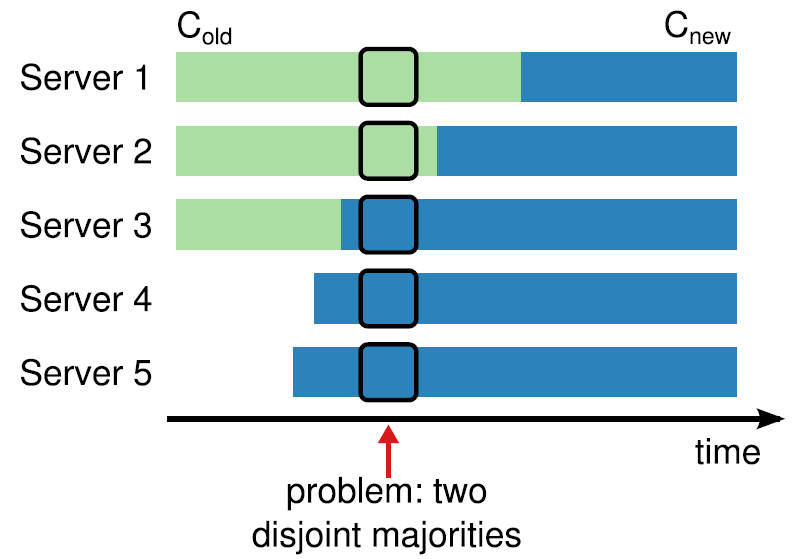

由于成员变更的这一特殊性，成员变更不能当成一般的一致性问题去解决。

为了解决这一问题，Raft提出了两阶段的成员变更方法。集群先从旧成员配置Cold切换到一个过渡成员配置，称为共同一致（joint consensus），共同一致是旧成员配置Cold和新成员配置Cnew的组合Cold U Cnew，一旦共同一致Cold U Cnew被提交，系统再切换到新成员配置Cnew。

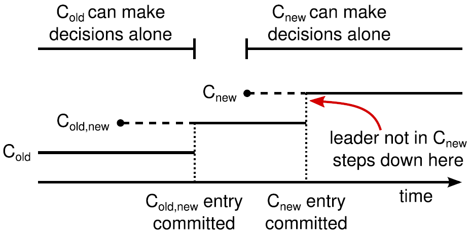

Raft两阶段成员变更过程如下：
1. Leader收到成员变更请求从Cold切成Cold,new；
2. Leader在本地生成一个新的log entry，其内容是Cold∪Cnew，代表当前时刻新旧成员配置共存，写入本地日志，同时将该log entry复制至Cold∪Cnew中的所有副本。在此之后新的日志同步需要保证得到Cold和Cnew两个多数派的确认；
3. Follower收到Cold∪Cnew的log entry后更新本地日志，并且此时就以该配置作为自己的成员配置；
4. 如果Cold和Cnew中的两个多数派确认了Cold U Cnew这条日志，Leader就提交这条log entry并切换到Cnew；
5. 接下来Leader生成一条新的log entry，其内容是新成员配置Cnew，同样将该log entry写入本地日志，同时复制到Follower上；
6. Follower收到新成员配置Cnew后，将其写入日志，并且从此刻起，就以该配置作为自己的成员配置，并且如果发现自己不在Cnew这个成员配置中会自动退出；
7. Leader收到Cnew的多数派确认后，表示成员变更成功，后续的日志只要得到Cnew多数派确认即可。Leader给客户端回复成员变更执行成功。

异常分析：
1. 如果Leader的Cold U Cnew尚未推送到Follower，Leader就挂了，此后选出的新Leader并不包含这条日志，此时新Leader依然使用Cold作为自己的成员配置。
2. 如果Leader的Cold U Cnew推送到大部分的Follower后就挂了，此后选出的新Leader可能是Cold也可能是Cnew中的某个Follower。
3. 如果Leader在推送Cnew配置的过程中挂了，那么同样，新选出来的Leader可能是Cold也可能是Cnew中的某一个，此后客户端继续执行一次改变配置的命令即可。
4. 如果大多数的Follower确认了Cnew这个消息后，那么接下来即使Leader挂了，新选出来的Leader肯定位于Cnew中。

两阶段成员变更比较通用且容易理解，但是实现比较复杂，同时两阶段的变更协议也会在一定程度上影响变更过程中的服务可用性，因此我们期望增强成员变更的限制，以简化操作流程。

两阶段成员变更，之所以分为两个阶段，是因为对Cold与Cnew的关系没有做任何假设，为了避免Cold和Cnew各自形成不相交的多数派选出两个Leader，才引入了两阶段方案。

如果增强成员变更的限制，假设Cold与Cnew任意的多数派交集不为空，这两个成员配置就无法各自形成多数派，那么成员变更方案就可能简化为一阶段。

那么如何限制Cold与Cnew，使之任意的多数派交集不为空呢？方法就是每次成员变更只允许增加或删除一个成员。

可从数学上严格证明，只要每次只允许增加或删除一个成员，Cold与Cnew不可能形成两个不相交的多数派。

一阶段成员变更：
1. 成员变更限制每次只能增加或删除一个成员（如果要变更多个成员，连续变更多次）。
2. 成员变更由Leader发起，Cnew得到多数派确认后，返回客户端成员变更成功。
3. 一次成员变更成功前不允许开始下一次成员变更，因此新任Leader在开始提供服务前要将自己本地保存的最新成员配置重新投票形成多数派确认。
4. Leader只要开始同步新成员配置，即可开始使用新的成员配置进行日志同步。

## Raft算法总结
Raft算法各节点维护的状态：  
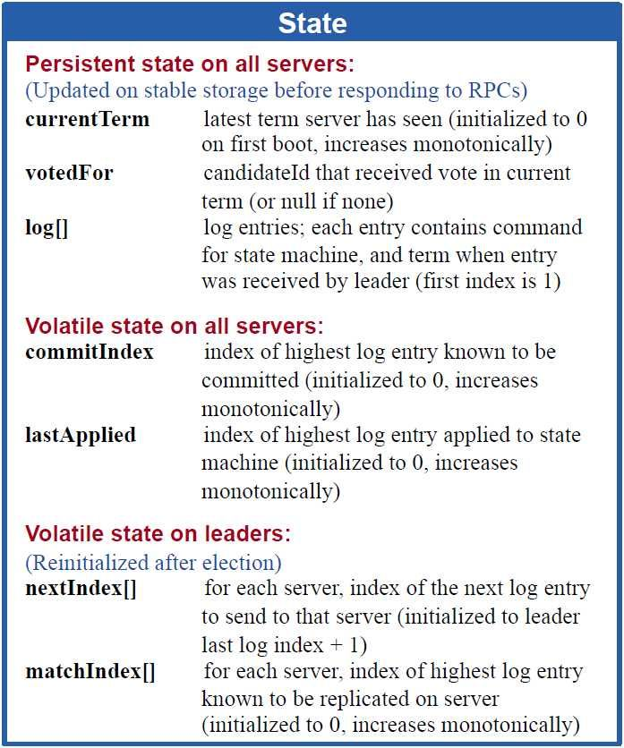

Leader选举：  
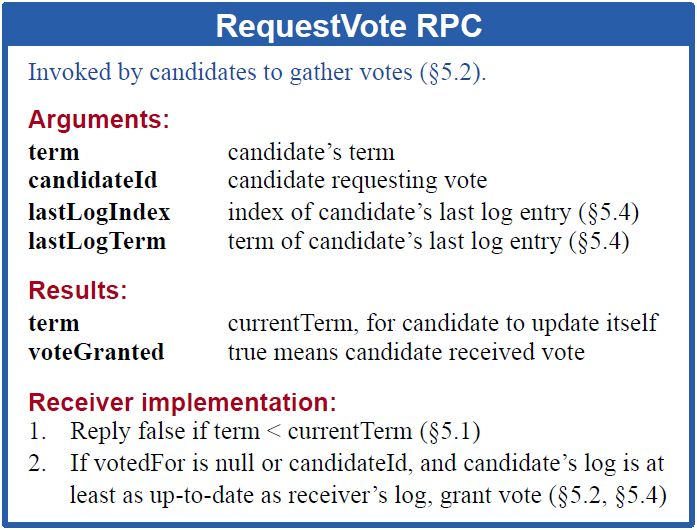

日志同步：  
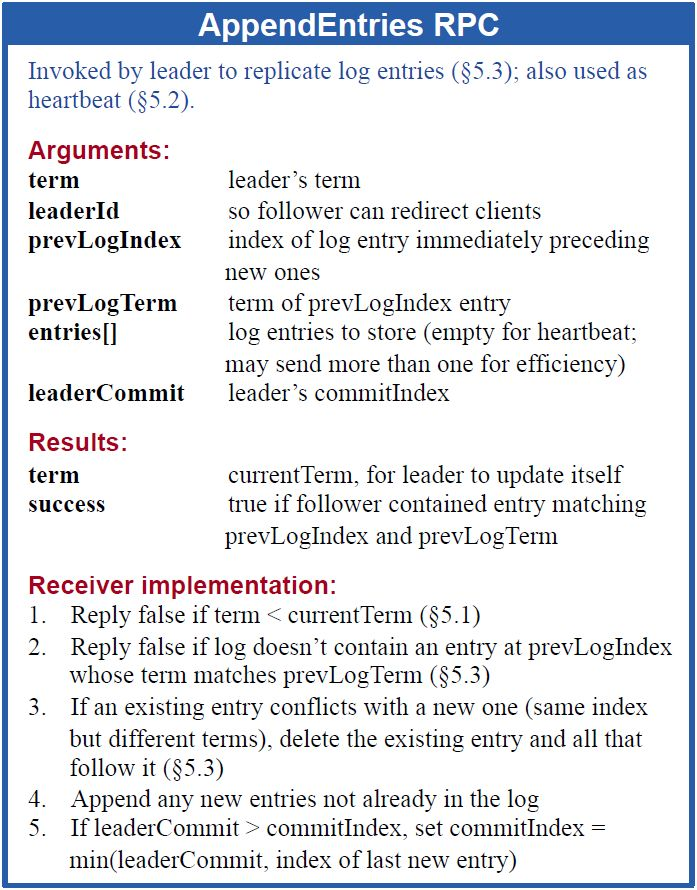

Raft状态机：  
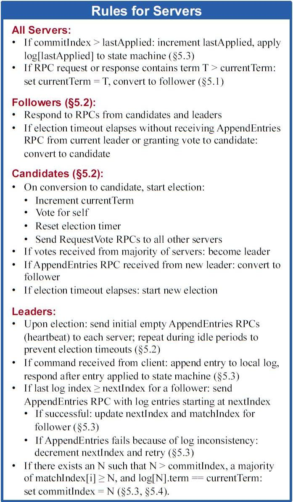

安装snapshot：  
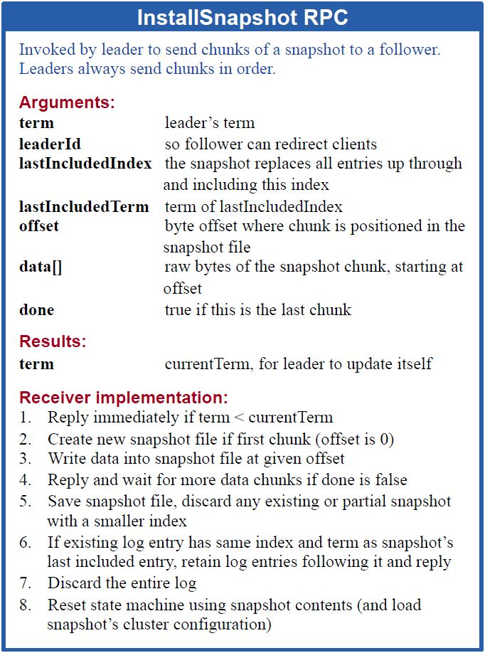

## 资源参考链接
[官网](https://raft.github.io/)  
[论文](https://raft.github.io/raft.pdf)（[中文版](https://github.com/maemual/raft-zh_cn/blob/master/raft-zh_cn.md)）  
[Raft可视化教程](http://thesecretlivesofdata.com/raft/)（[中文版](http://www.kailing.pub/raft/index.html)）  
[2020 MIT 6.824 分布式系统课程](git://g.csail.mit.edu/6.824-golabs-2020)（[学习资料](https://github.com/chaozh/MIT-6.824)）（[B站视频](https://www.bilibili.com/video/BV1R7411t71W?p=1)）  
